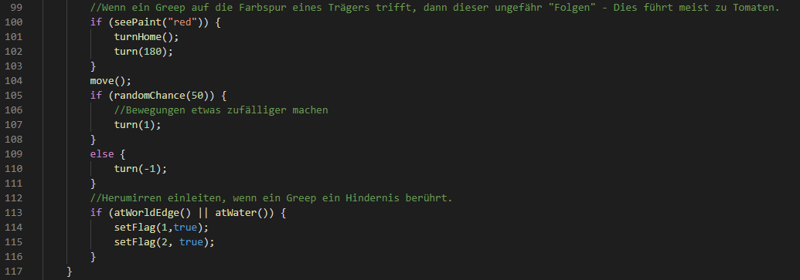
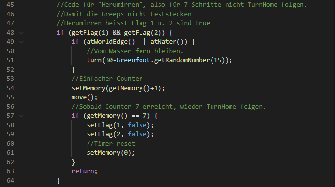
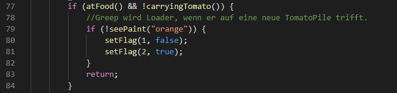
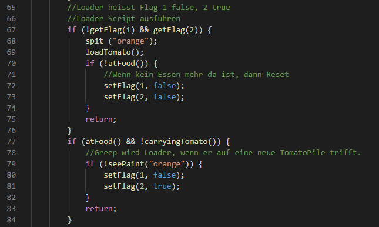
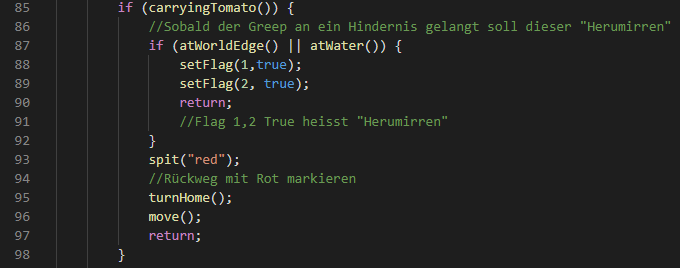
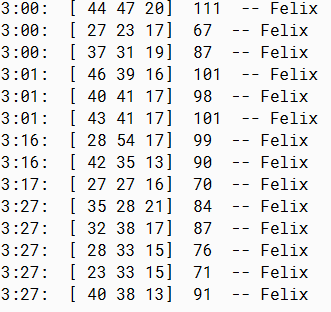

# Projektseite

[Zurück zur Hauptseite](https://github.com/Felixzed/InformatikProjektGreeps)

# Einführung:

Hallo! Hier finden Sie meine Erklärung der Funktionsweise meiner Greeps. Ich gehe auf Segmente von dem Code ein, und stelle am Ende eine Kleine Testreihe vor.

Greeps ist ein Programmierwettbewerb in dem man den außerirdischen Käfer, genannt "Greeps" eine künstliche Intelligenz mit Limitierungen programmieren muss, man ist limitiert auf zwei boolean-Werte und eine 8-bit Integer. Hiermit muss man versuchen die höchstmögliche Punktzahl zu erreichen, in dem man so viele Tomaten wie möglich von den zufällig auf der Karte generierten Tomatenhaufen zu dem Mutterschiff der Greeps bringt. 

## Flags

Mit den zwei gegebenen Flags sind insgesamt vier Status möglich, letztendlich ein 2-bit Wert, diese Status sind:
```
00 = (Flag 1 false : Flag 2 false)
01 = (Flag 1 false : Flag 2 true)
10 = (Flag 1 true : Flag 2 false)
11 = (Flag 1 true : Flag 2 true)
```
Hierbei werden diese so verwendet:

```
0-0 = Sucher
0-1 = Loader
1-0 = Nicht verwendet
1-1 = Hindernis Umgehen
```
## Sucher

Das "Normalverhalten" eines Greeps.
Dieser bewegt sich durchgehend nach vorne und dreht sich zufällig um ein Grad links oder rechts.

Hindernisse wie Wasser oder das Ende der Welt umgeht er mithilfe der Umgehfunktion der Flags 1-1.

Ein Sucher kann, wie bereits oben genannt, zum Träger oder zum Loader werden.
Sobald ein Sucher eine rote Farbspur erkennt, dreht er sich zum Schiff und dreht sich um 180°. Da die Träger die meiste Zeit ihren Rückweg in Richtung des Schiffes gehen, führt dieser Weg, wenn man ihm zurück folgt, meist zu mehr Tomaten.

Mittels RandomChance erhält der Sucher etwas mehr Zufall in seiner Bewegung, damit er etwas mehr Fläche abdeckt. In jedem Arbeitstakt bewegt er sich entweder 1° gegen- oder mit dem Uhrzeigersinn. 



## Hindernisse
Um Hindernisse zu umgehen wird ein Timer verwendet. Wenn ein Greep auf ein Hindernis stößt, werden die Flags des Greeps auf 1-1 gesetzt. Der Greep dreht sich immer, wenn er auf Wasser stößt, zufällig gegen den Uhrzeigersinn.

Während 1-1 aktiv ist, wird der Speicher des Greeps für einen Zähler verwendet. Während dieser Zähler zählt, bewegt sich der Greep auf einem geraden Kurs. Sobald das Script sieben mal durchlaufen ist werden die Flags auf 0-0 gesetzt.



Letztendlich hält hierdurch der Greep für Sieben Durchläufe einen unabhängigen Kurs. Mit diesem Ansatz kann ein Greep nicht mehr an einem Hindernis "Feststecken". Auch kann ein Greep, welcher den TurnHome-Befehl verwendet, viel Besser um Hindernisse navigieren. 

## Loader
Wenn ein Greep, welcher kein Träger ist, auf eine TomatoPile trifft, checkt dieser ob ein orangener Farbklecks vorhanden ist. Wenn bereits ein Klecks sichtbar ist, Passiert nichts.
Wenn keine Farbe vorhanden ist, wird Flag 2 true und Flag 1 false gesetzt.



Der Greep weiß nun, dass er sich nicht mehr bewegen soll.
Dieser Greep ist nun ausschließlich für das verladen von Tomaten zuständig und tut dies solange Tomaten auf dem Tomatenhaufen vorhanden sind.
Von ihm wird durchgehend ein orangener Farbklecks auf den Boden "gespuckt", dies zeigt anderen Greeps, dass hier bereits ein Loader vorhanden ist.
Ein Loader prüft durchgehend, ob Essen vorhanden ist. Wenn nichts vorhanden ist, werden die Flags wieder auf 0-0 gesetzt.



## Träger

Sobald ein Loader einem Greep eine Tomate auflädt, versucht dieser zu dem Schiff schnellstmöglich zurückzukehren, er tut dies über einen TurnHome-Befehl.
Sobald er auf ein Hindernis trifft, werden die Flags auf 1-1 gesetzt und somit das Ausweichverhalten eingeleitet.



Der Weg der der Träger zurücklegt wird mit einer roten Farbspur markiert, um später den Suchern die generelle Richtung eines Tomatenhaufens zu geben. 

# Resultate



```
Bester Wert = 111
Durchschnittswert = 81
Niedrigster Wert = 67
```
