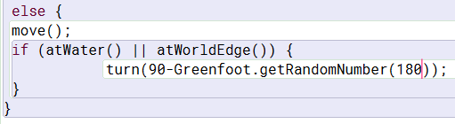

# Stundenbericht Informatikprojekt

### [Zurück zur Hauptseite](https://github.com/Felixzed/InformatikProjektGreeps)

## Erste Stunde: Vorarbeit, 45 min.

Austausch m. Herr Buhl über potentielle Projektmöglichkeiten

Unreal Engine keine Möglichkeit mehr.
Greenfoot wurde vorgeschlagen, ich habe mich in das Buch dann eingelesen.
Etwas nachforschung zu Greenfoot betrieben, Projektseite auf Github erstellt. 

## Zweite Stunde: Projekt entscheiden, 45 min.

Entscheidung getroffen: Greeps als Projekt ausgewählt.
Erste Forschung an Programmierung mit Greenfoot - Verschiedene Statements "If, else, switch" etc.
Projekt heruntergeladen, experimente mit Ausweichverhalten von Greeps
Ausdenken Konzepte für Funktionsweise v. Greeps.


```
Erste Ausführung des Bewegungs-Scripts
```
## Dritte Stunde: Einführung erste Konzepte, 45 min.

Erster Konzept - Loader:


```
Ein Loader in seinem natürlichen Habitat
```


Da zwei Greeps für den Beladungsprozess nötig sind, ist das Konzept des "Loaders" entstanden, welcher an den Tomatenhaufen stehen bleibt und die Tomaten verlädt.
Ich habe mich entschieden den Loader per Flag zu designieren, hierbei hat Flag 2 angegeben, ob der Greep ein Loader ist.


Dieses Konzept erwies sich als erfolgreich, die Greeps brachten deutlich mehr Tomaten auf das Schiff. 

```
Erste Ausführung des Scripts eines Loaders
```
Nun wurde der Arbeitsfluss am meisten durch Probleme mit der Navigation aufgehalten, viele Greeps blieben an den Rändern von Hindernissen wie z.B. Seen stecken. Greeps die Tomaten zurücktrugen blieben auch oft wegen des TurnHome-Befehls stecken.
Ein einfacher Turn(45);-Befehl bei Kontakt mit einem Hindernis reichte nicht aus.
## Vierte Stunde: Ausweich-Tests, 45 min. 

Hier experimentierte ich mit besseren Methoden des Ausweichens, sobald ein Greep auf ein Hindernis trifft, wird nun per  90-Greenfoot.GetRandomNumber(180);  entschieden dass der Greep sich zufällig im Rahmen von 0-90° gegen oder mit dem Uhrzeigersinn dreht. In der Praxis befand sich der wert von Greenfoot.GetRandomNumber(180); meist im Bereich 80-100, somit irrten die Greeps oft an den Rändern von Hindernissen herum und verschwendeten Zeit, da sie manchmal kurz davor waren sich frei zu drehen, aber dann durch zufall sich wieder in die entgegengesetzte Richtung drehen.



## Fünfte Stunde: Problemlösung, 45 min.

Zuerst versuchte ich zum lösen des Problems der letzten Stunde an den verschiedenen Zahlen in z.B. Greenfoot.GetRandomNumber(); etwas zu ändern, um vielleicht eine gut funktionierende Kombination zu finden, dies erwies sich als erfolgreich, allerdings nur für die Greeps, die nicht mit Tomaten beladen sind. 

Die beladenen Greeps nehmen durchgehend Kurs auf das Schiff, das Script für diese sah so aus:


```
Die Quelle der vielen Probleme
```
## Sechste Stunde: Neues Ausweichkonzept, 45 min.

Neues Konzept: Ausweichverhalten durch das ignorieren von TurnHome(); in einer Zeitspanne

Erster Ansatz war ein System, in dem ein Greep bei Kontakt mit einem Hindernis Flag 1 auf wahr setzte, sich dreht und dann einem geraden Pfad folgte bis ein neues Hindernis getroffen wird. Danach dreht sich der Greep nocheinmal und folgt Turnhome();

Dieses System hat sich als ineffizient und Zeitaufwändig herausgestellt, besonders da die Greeps sehr große Pfade quer über die ganze Karte nahmen.

Das Konzept des Ausweichverhaltens über einen Zeitraum musste also anders umgesetzt werden.

## Siebte Stunde: Weitere Arbeit Ausweichkonzept, 45 min.

In dieser Stunde habe ich weitere Möglichkeiten für Ausweichkonzepte erstellt, nach langer überlegung habe ich micht entschieden mit dem SetMemory();-Befehl einen Timer zu erstellen.

## Achte Stunde: Weitere Arbeit Ausweichkonzept, 45 min.

Greeps, welche mit einer Tomate beladen sind, erstellen nun eine Rote Farbspur welcher die suchenden Greeps grob folgen können. Dies geschieht, in dem die suchenden Greeps, sobald sie auf einen Farbklecks treffen, sich zu dem Schiff und dann um 180° drehen. Dieses Script funktioniert anhand des Prinzips, das sich die Träger-Greeps oft anhand des Schiffes orientieren.


Ein Loader prüft ebenfalls nun, ob an seinem Standpunkt überhaupt noch verladbare Tomaten vorhanden sind: 


## Heimarbeit: 4 Std. 

Hier habe ich mich entschieden, das Script vollkommen neu zu schreiben, da das alte zu unleserlich wurde.

Neues Konzept: Flags als 2-Bit-Binär-Wert

Mit den zwei gegebenen Flags sind vier Zustände möglich, in dem neuen Script folgen die verschiedenen Stadien diesen Flags, welche am Anfang des Scripts abgefragt werden:
```
0-0 = Sucher
0-1 = Loader
1-0 = Nicht verwendet
1-1 = Hindernis Umgehen
Mehr hierzu auf der Projektseite
```
Die Prinzipien hinter dem Sucher und dem Loader sind identisch zu dem früheren Prinzip, nun benutzen sie allerdings einen komplett neuen Algorhytmus um ein Hindernis zu umgehen, wenn ein Greep auf ein Hindernis stößt, setzt er seine Flags auf 1-1.


Der Speicher des Greeps wird nun verwendet, um ein